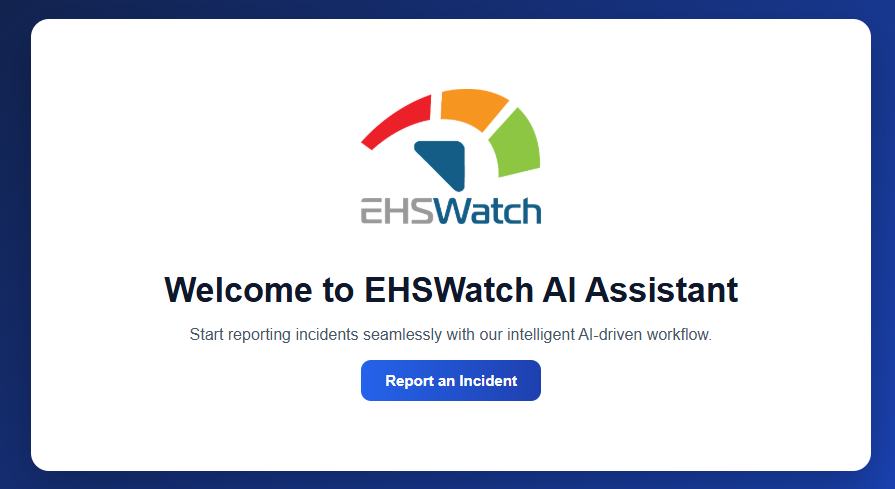
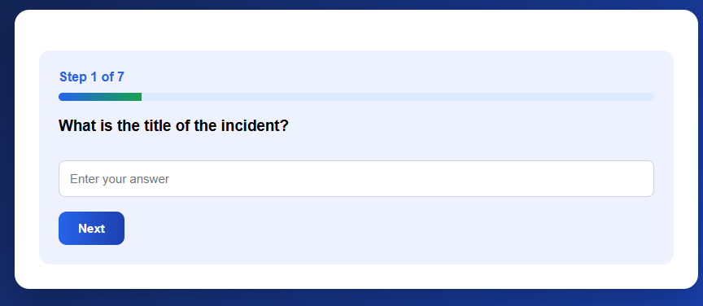
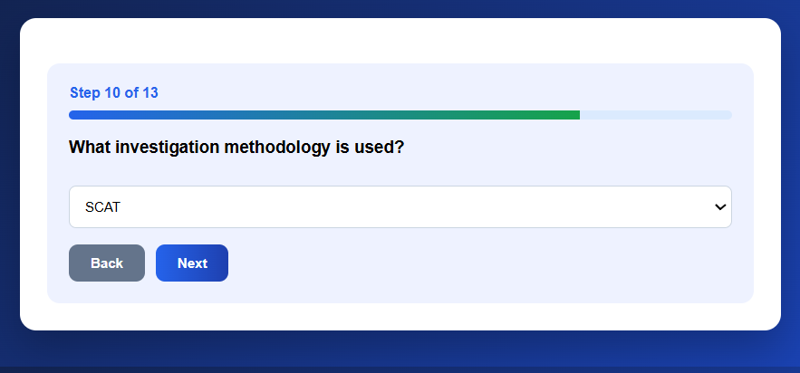
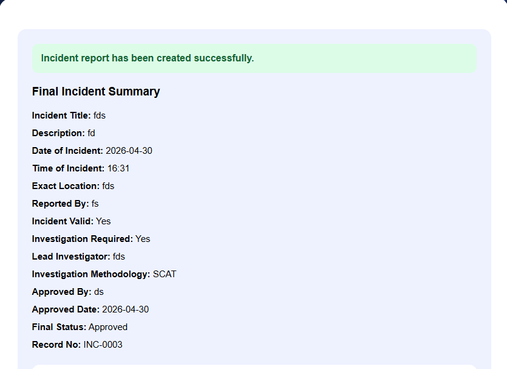
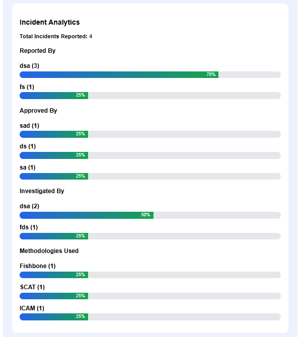
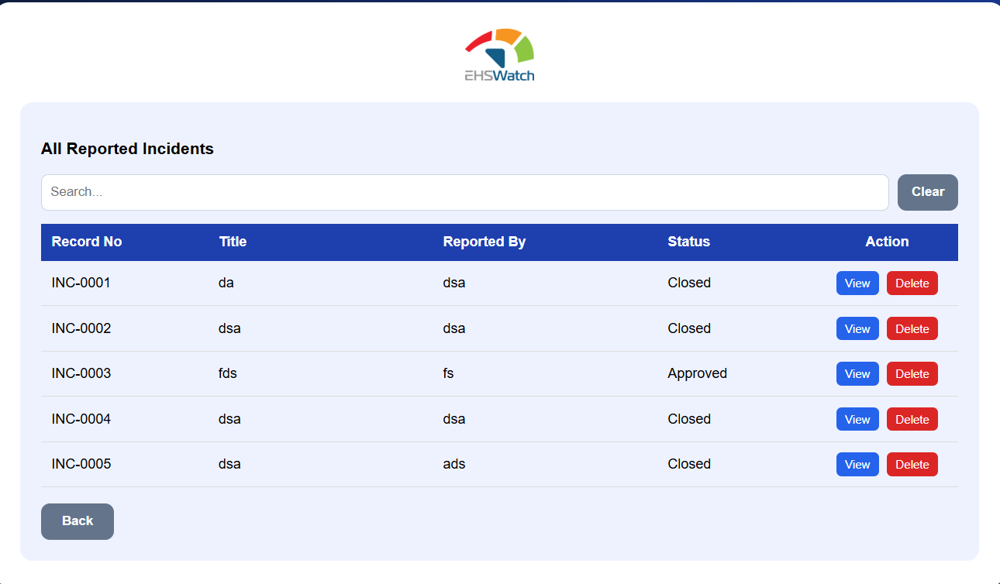
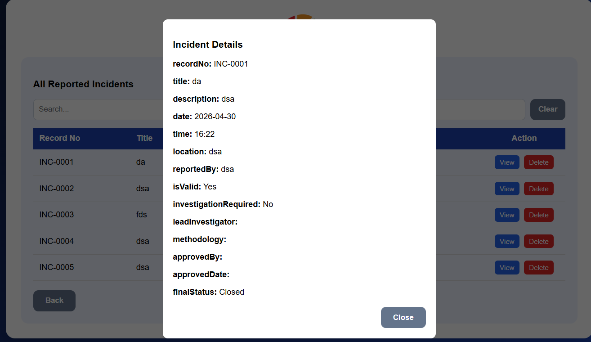

# AI Incident Reporting Assistant

A simple browser-based incident reporting assistant built using HTML, CSS, and JavaScript.

## Features
- Step-by-step incident reporting
- Auto current date and time
- Dynamic investigation workflow
- Record number generation
- Incident analytics
- Export to Excel
- Export to PDF

## Technologies Used
- HTML
- CSS
- JavaScript
- Browser LocalStorage

## How to Run
Open `index.html` in any browser.

## Future Enhancements
- Store data in backend database
- Add login and roles
- Add edit/view incident list
- Add real charts
- Deploy using GitHub Pages

## Screenshots

### Landing Page

### Incident Questions

### Investigation Flow

### Final Summary

### Analytics Dashboard

### Export Options

### Incident List Page

### Search & Filter

### View Incident Details

## Live Demo
https://automatemounica.github.io/ai-incident-assistant/